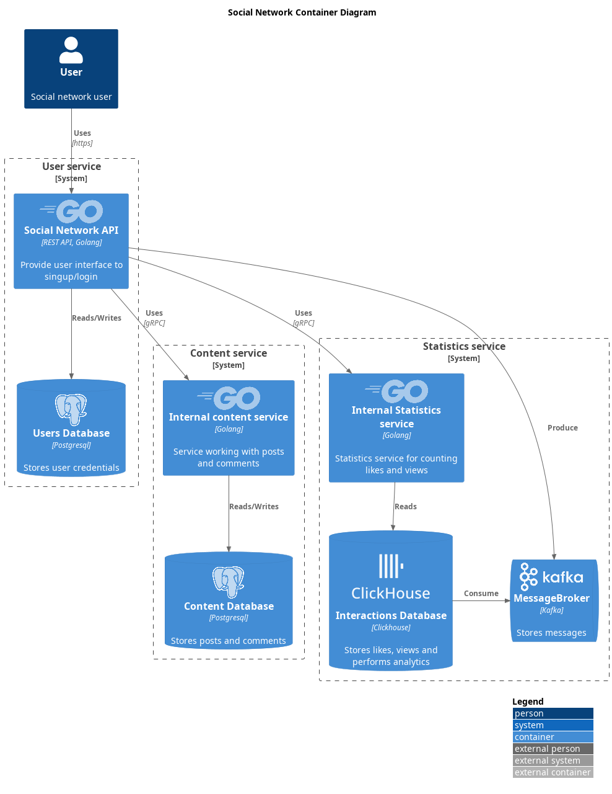

## Кривда Матвей 215
# Social network

A study project written as part of the Service Oriented Architectures course at HSE. The project focuses on learning microservice architecture and associated technologies by developing a prototype of a social network. It utilizes a contract-first approach using OpenAPI and Swagger code generation. We employ the C4 model with PlantUML to create architectural diagrams and implement three microservices written in Golang.

The prototype incorporates various types of interactions, including synchronous and asynchronous communication, implemented through REST API and gRPC. We utilize PostgreSQL for relational data storage, Kafka for event streaming, and ClickHouse for analytics.

Through this project, we explore the intricacies of microservices, different communication patterns, and a variety of technologies relevant to modern software development.

